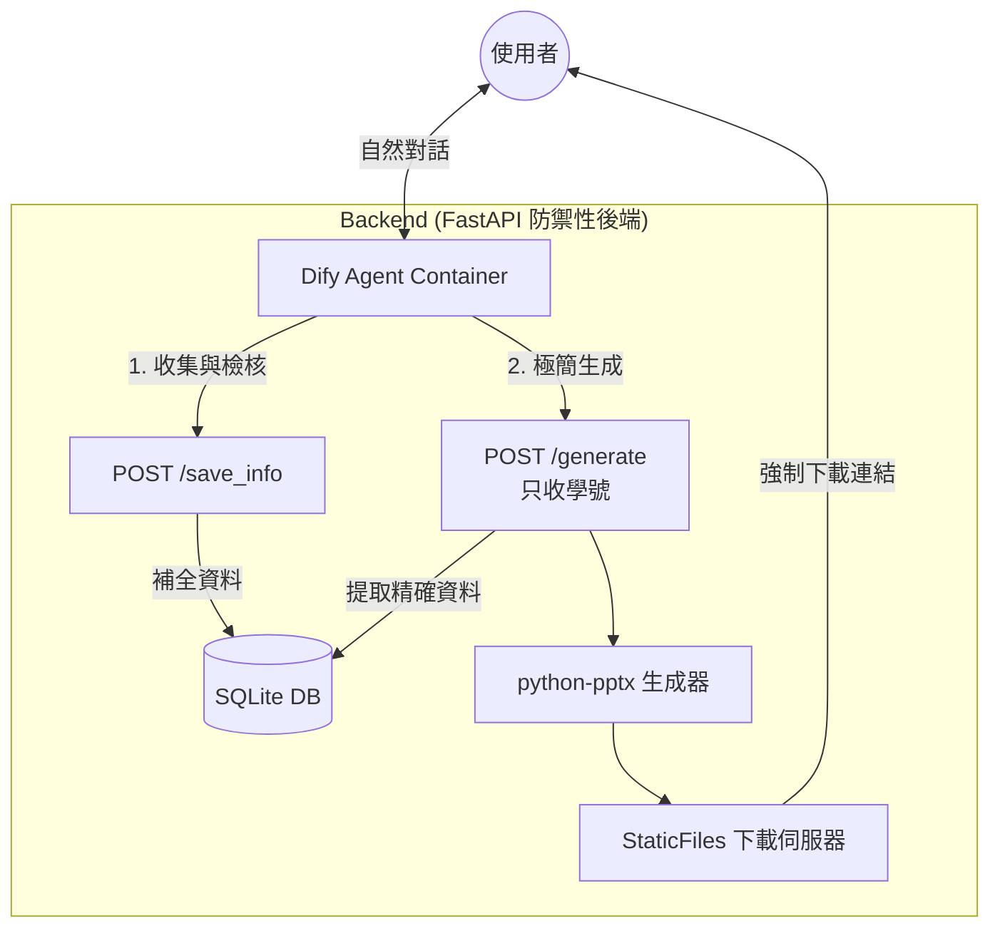

#  Defense-Bot: 智慧口試佈告生成系統

結合 **AI 對話流程 (Dify)** 與 **自動化排版 (Python)** 的微服務工具。協助研究生透過自然語言對話，快速查詢資料庫、補全教授職稱，並生成對應的口試佈告 PPT。

---

##  核心功能 (Key Features)
本系統依據以下使用者故事開發，旨在解決行政流程痛點：

1. **身份智慧查詢 (Smart Identity Lookup)**
   * **功能**: 輸入學號 (e.g., M11402165) 或姓名，系統自動帶出完整論文題目（中英）與指導教授資訊。
   * **解決**: 避免重複輸入與打錯字的風險。
2. **教授模糊搜尋與糾錯 (Fuzzy Search)**
   * **功能**: 輸入教授名字時容許錯字或同音字 (e.g., 輸入「曾瑞光」自動修正為「鄭瑞光」)。
   * **解決**: 解決因輸入錯誤導致無法對應資料的問題。
3. **職稱自動補全 (Professor Metadata Auto-fill)**
   * **功能**: 自動將教授姓名擴充為正式格式 (e.g., 鄭瑞光 教授 臺灣科技大學電子工程系)。
   * **解決**: 確保輸出的 PPT 符合系所嚴格的格式規範。
4. **自然語言時空解析 (NLP Context Parsing)**
   * **功能**: 支援口語輸入 (e.g., "下週五下午三點在 T2-202")，自動轉換為標準日期與地點格式。
   * **解決**: 提升輸入效率，無需操作繁瑣的日曆介面。
5. **一鍵生成交付 (One-Click Generation)**
   * **功能**: 確認資訊無誤後，即時生成排版完美的 `.pptx` 檔案下載連結。

---

##  系統架構 (System Architecture)
本專案採用 **全本地部署 (Local Deployment)** 策略，透過 Docker Network 串聯 AI 大腦與後端手腳。


Workflow: Dify (負責對話邏輯、Slot Filling)

Backend: Python FastAPI (負責資料庫查詢、PPT 生成)

Database: SQLite (輕量化單檔儲存)

 快速開始 (Quick Start)
我們提供了一鍵部署腳本，讓您在 5 分鐘內建立完整的本地環境。

前置需求 (Prerequisites)
Docker & Docker Compose

Git

1. 下載專案
```Bash
git clone [https://github.com/yoyo27987536/defense-bot.git](https://github.com/yoyo27987536/defense-bot.git)
cd defense-bot
```
2. 環境設定
複製範例設定檔（預設值即可運作，已避開預設 Port 防止衝突）：

```Bash
cp .env.example .env
```
3. 一鍵部署 (One-Click Deploy)
執行安裝腳本，系統將自動建立網路、下載 Dify 映像檔並啟動所有服務：

```Bash
chmod +x install.sh
./install.sh
```
4. 驗證服務
部署完成後，請訪問：

Dify 控制台: http://localhost/ (首次登入需註冊管理員)

Backend API 文件: http://localhost:8088/docs

⚙️ Dify 設定指南 (重要！)
由於 Dify 的安全性設計，您需要手動將後端 API 註冊到 Dify 中：

取得 API 規格: 複製 http://localhost:8088/openapi.json 的完整內容。

建立自定義工具:

登入 Dify > 工具 (Tools) > 自定義 (Custom) > 創建自定義工具。

Schema: 貼上剛複製的 JSON。

Server URL: 輸入 http://defense-bot-backend:8088 (請勿使用 localhost)。

匯入機器人流程:

建立一個新的 Chatflow 應用。

點擊右上角選單 > 匯入 DSL。

選擇專案目錄下的 workflow/defense-bot.yml。

##  專案結構 (Project Structure)

```text
defense-bot/
├── install.sh              # 🚀 一鍵部署主腳本
├── docker-compose.yml      # 🐳 Backend 容器編排
├── .env.example            # 🔐 環境變數範例
├── README.md               # 📖 專案說明書
│
├── workflow/               # ✨ Dify Agent 設定備份
│   └── defense-bot.yml     # Dify DSL (匯入此檔以還原對話流程)
│
├── templates/              # 🎨 PPT 模板庫
│   └── defense_template.pptx
│
├── backend/                # 🐍 Python 後端核心
│   ├── main.py             # 🚦 總機與路由
│   ├── models.py           # 🗄️ 資料庫模型定義
│   ├── schemas.py          # 🛡️ Pydantic 防呆海關
│   ├── seed.py             # 🌱 開機自動播種腳本
│   ├── database.py         # 🔌 資料庫連線設定
│   ├── services/           # 🧠 核心邏輯 (PPT 生成)
│   └── downloads/          # 📥 PPT 產出暫存區
│
└── data/                   # 💾 資料與設定檔 
    ├── defense.db          # SQLite 資料庫 (啟動自動生成)
    ├── students.csv        # 學生名單
    └── professors.csv      # 教授名單 
```
## 資料維護 (Data Maintenance)
若要新增學生或教授資料，請直接編輯 data/ 目錄下的 CSV 檔案，並重啟後端容器以重新匯入資料庫：

data/professors.csv: name,title,department

data/students.csv: id,name,title_zh,title_en,advisor_name

```Bash
docker compose restart backend
```