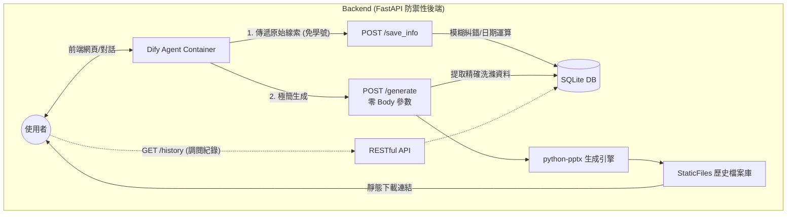

# Defense-Bot: 智慧口試佈告生成系統

結合 **AI 對話流程 (Dify)** 與 **自動化排版 (Python)** 的微服務工具。協助研究生透過自然語言對話，快速查詢資料庫、補全教授職稱，並生成對應的口試佈告 PPT。

---

##  核心價值與系統亮點 (Key Features & Value Proposition)

本系統改善傳統繁瑣的表單填寫與排版流程，透過「AI 語意理解」與「後端強勢防呆」的完美接力，打造流暢且零容錯的使用體驗：

### 1. 意圖驅動的極簡輸入 (Intent-Driven Context Parsing)
* **融合功能**：身份智慧綁定 + 自然語言時空解析
* **使用情境**：使用者登入後，系統即透過 Header 驗證自動綁定其論文題目與指導教授。使用者只需像聊天般輸入口語指令（例如：「*下週五下午三點在 T2-202，委員是鄭瑞洸*」），系統便會自動將時空資訊精準解析為標準格式。
* **解決痛點**：徹底免除重複輸入學號、論文題目等冗長資訊的麻煩，更省去操作複雜日曆與下拉選單的認知負擔。

### 2. 零容錯的智慧糾錯與補全 (Zero-Fault Auto-Correction)
* **融合功能**：模糊搜尋 (Fuzzy Search) + 職稱自動補全 + 防禦性後端
* **使用情境**：當使用者打錯字或只給簡稱時，後端會啟動強大的容錯機制。例如，將「曾瑞洸」自動校正為「鄭瑞光」，並補全為「鄭瑞光 教授 臺灣科技大學電子工程系」，同時會啟動防呆機制，強制將指導教授加入口試名單中。
* **解決痛點**：消滅因打錯字或漏填導致的行政退件風險，確保產出的資料符合規範。

### 3. 閉環的自動化交付與資產管理 (Automated Delivery & Asset Management)
* **融合功能**：一鍵生成交付 + 專屬歷史紀錄儀表板
* **使用情境**：確認資訊無誤後，系統會即時產出排版完美的 `.pptx` 佈告檔案供一鍵下載，更會將此次生成的完美草稿與檔案連結永久歸檔至資料庫。
* **解決痛點**：將「用完即丟的聊天機器人」升級為使用者的「個人管家」，實現免重複對話即可隨時透過前端調閱、下載歷史版本。

---

##  系統架構 (System Architecture)
本專案採用 **全本地部署 (Local Deployment)** 策略，透過 Docker Network 串聯 AI 大腦與後端手腳。


* **前端/Agent**: Dify (負責語意理解、Slot Filling)
* **Backend**: Python FastAPI (負責身分驗證、資料洗滌、Fuzzy Search、PPT 渲染)
* **Database**: SQLite (輕量化單檔儲存，包含歷史生成紀錄)

---

##  快速開始 (Quick Start)
我們提供了一鍵部署腳本，讓您在 5 分鐘內建立完整的本地環境。

### 前置需求 (Prerequisites)
* Docker & Docker Compose
* Git

### 1. 下載專案
```Bash
git clone [https://github.com/yoyo27987536/defense-bot.git](https://github.com/yoyo27987536/defense-bot.git)
cd defense-bot
```

### 2. 環境設定
複製範例設定檔（預設值即可運作，已避開預設 Port 防止衝突）：
```Bash
cp .env.example .env
```

### 3. 一鍵部署 (One-Click Deploy)
執行安裝腳本，系統將自動建立網路、下載 Dify 映像檔並啟動所有服務：
```Bash
chmod +x install.sh
./install.sh
```

### 4. 驗證服務
部署完成後，請訪問：
* **Dify 控制台**: `http://localhost/` (首次登入需註冊管理員)
* **Backend API 文件**: `http://localhost:8088/docs` (請使用 Header 注入 `x-student-id` 進行測試)

---

##  Dify 設定指南 (重要！)
由於 Dify 的安全性設計與本系統的 Zero-Trust 架構，您需要手動將後端 API 註冊到 Dify 中：

1. **取得 API 規格**: 複製 `http://localhost:8088/openapi.json` 的完整內容。
2. **建立自定義工具**:
   * 登入 Dify > 工具 (Tools) > 自定義 (Custom) > 創建自定義工具。
   * **Schema**: 貼上剛複製的 JSON。
   * **Server URL**: 輸入 `http://defense-bot-backend:8088` (請勿使用 localhost)。
   * **自定義 Header**: 請務必新增一組 Header，名稱為 `x-student-id`，值填入您的學號 (e.g., `M11402165`) 以通過 API 驗證。
3. **匯入機器人流程**:
   * 建立一個新的 Chatflow 應用。
   * 點擊右上角選單 > 匯入 DSL。
   * 選擇專案目錄下的 `workflow/defense-bot.yml`。

---

##  專案結構 (Project Structure)

```text
defense-bot/
├── install.sh              # 🚀 一鍵部署主腳本
├── docker-compose.yml      # 🐳 Backend 容器編排
├── .env.example            # 🔐 環境變數範例
├── README.md               # 📖 專案說明書 (主入口)
├── .gitignore              # 🙈 Git 忽略清單
│
├── docs/                   # 📚 專案文件庫
│   ├── API.md              # API 規格與呼叫說明
│   ├── SCHEMA.md           # 資料庫設計與 ER 圖
│   └── UI_UX.md            # 介面與體驗設計規劃
│
├── workflow/               # ✨ Dify Agent 設定備份
│   └── defense-bot.yml     # Dify DSL (匯入此檔以還原對話流程)
│
├── templates/              # 🎨 PPT 模板庫 (全域共用)
│   └── defense_template.pptx
│
├── backend/                # 🐍 Python 後端核心 
│   ├── main.py             # 🚦 總機與 API 路由 (含 Auth 攔截器)
│   ├── models.py           # 🗄️ 資料庫模型定義
│   ├── schemas.py          # 🛡️ Pydantic(資料檢核)
│   ├── seed.py             # 🌱 開機自動播種腳本
│   ├── database.py         # 🔌 資料庫連線設定
│   ├── services/           # 🧠 核心邏輯
│   │   └── generator.py    # python-pptx 排版引擎
│   ├── downloads/          # 📥 PPT 歷史產出暫存區 
│   ├── Dockerfile          # 🐳 後端容器建置腳本
│   └── requirements.txt    # 📦 Python 依賴套件清單
│
└── data/                   # 💾 資料與設定檔
    ├── defense.db          # SQLite 資料庫 (伺服器啟動自動生成)
    ├── students.csv        # 學生名單
    └── professors.csv      # 教授名單
```

---

##  資料維護 (Data Maintenance)
若要新增學生或教授資料，請直接編輯 `data/` 目錄下的 CSV 檔案，並重啟後端容器以重新匯入資料庫：
* `data/professors.csv`: `name,title,department`
* `data/students.csv`: `id,name,title_zh,title_en,advisor_name`

```Bash
docker compose restart backend
```