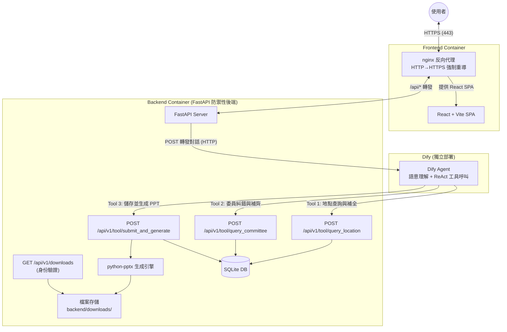

# Defense-Bot: 智慧口試佈告生成系統

結合 **AI 對話流程 (Dify Agent)** 與 **自動化排版 (Python-pptx)** 的微服務工具。協助研究生透過自然語言對話，快速查詢地點、補全教授職稱，並一鍵生成對應的口試佈告 PPT。

---

##  核心價值與系統亮點 (Key Features & Value Proposition)

本系統改善傳統繁瑣的表單填寫與排版流程，透過「AI 語意理解」與「後端強勢防呆」的完美接力，打造流暢且零容錯的使用體驗：

### 1. 意圖驅動的極簡輸入 (Intent-Driven Context Parsing)
* **融合功能**：身份智慧綁定 + 自然語言時空解析
* **使用情境**：使用者登入後，系統即透過 `x-student-id` Header 驗證自動綁定其論文題目與指導教授。使用者只需像聊天般輸入口語指令（例如：「*下週五下午三點在 T2-202，委員是鄭瑞洸*」），Dify Agent 便會自動拆解意圖，逐步呼叫後端 Tool API 將資訊精準解析為標準格式。
* **解決痛點**：徹底免除重複輸入學號、論文題目等冗長資訊的麻煩，更省去操作複雜日曆與下拉選單的認知負擔。

### 2. 零容錯的智慧糾錯與補全 (Zero-Fault Auto-Correction)
* **融合功能**：模糊搜尋 (Fuzzy Search) + 職稱自動補全 + 地點模糊比對 + 防禦性後端
* **使用情境**：當使用者打錯字或只給簡稱時，後端會啟動強大的容錯機制。例如，將「曾瑞洸」自動校正為「鄭瑞光」，並補全為「鄭瑞光 教授 (臺灣科技大學電子工程系)」；輸入「T2-202」便自動補全為「第二教學大樓 T2-202會議室」。同時會啟動防呆機制，強制將指導教授加入口試名單中，並回傳完整教授名冊供 LLM 進行諧音糾錯。
* **解決痛點**：消滅因打錯字或漏填導致的行政退件風險，確保產出的資料符合規範。

### 3. 閉環的自動化交付與資產管理 (Automated Delivery & Asset Management)
* **融合功能**：一鍵生成交付 + 專屬歷史紀錄儀表板
* **使用情境**：確認資訊無誤後，系統會即時產出排版完美的 `.pptx` 佈告檔案供一鍵下載，更會將此次生成的完美草稿與檔案連結永久歸檔至資料庫。
* **解決痛點**：將「用完即丟的聊天機器人」升級為使用者的「個人管家」，實現免重複對話即可隨時透過前端調閱、下載歷史版本。

---

##  系統架構 (System Architecture)
本專案採用 **可對外部署 (Internet-facing)** 架構，由三個獨立服務（Frontend nginx、Backend FastAPI、Dify Agent）組成，可分別部署在不同主機或不同 Docker 網路。前端 nginx 提供 HTTPS 反向代理與靜態資源服務。使用者透過 SPA 發送訊息，由 FastAPI 代理轉發至 Dify Agent，Dify Agent 再以 ReAct 工作流**回呼**後端的三支 Tool API 完成任務。PPT 下載透過身份驗證的 `/api/v1/downloads/` 端點進行，確保用戶只能下載自己的檔案。


```mermaid
graph TD
    User((使用者)) <-->|"HTTPS (443)"| Nginx

    subgraph Frontend["Frontend Container"]
        Nginx["nginx 反向代理<br/>HTTP→HTTPS 強制重導"] -->|提供 React SPA| SPA[React + Vite SPA]
    end

    subgraph DifyContainer["Dify (獨立部署)"]
        Dify["Dify Agent<br/>語意理解 + ReAct 工具呼叫"]
    end

    Nginx <-->|"/api/* 轉發"| Backend

    subgraph BackendContainer["Backend Container (FastAPI 防禦性後端)"]
        Backend[FastAPI Server]

        LocAPI["POST /api/v1/tool/query_location"]
        ComAPI["POST /api/v1/tool/query_committee"]
        GenAPI["POST /api/v1/tool/submit_and_generate"]
        DownAPI["GET /api/v1/downloads<br/>(身份驗證)"]

        LocAPI --> DB[(SQLite DB)]
        ComAPI --> DB
        GenAPI --> DB
        GenAPI --> PPT[python-pptx 生成引擎]
        PPT --> DL["檔案存儲<br/>backend/downloads/"]
        DownAPI --> DL
    end

    Backend -->|"POST 轉發對話 (HTTP)"| Dify
    Dify --"Tool 1: 地點查詢與補全"--> LocAPI
    Dify --"Tool 2: 委員糾錯與補齊"--> ComAPI
    Dify --"Tool 3: 儲存並生成 PPT"--> GenAPI
```
* **前端**: React + Vite SPA（對話介面 + 儀表板），由 nginx 容器獨立服務，負責 HTTP→HTTPS 強制重導、TLS 終端與 API 反向代理
* **AI Agent**: Dify（獨立部署，負責語意理解、Slot Filling、ReAct 工具呼叫，透過 HTTP 回呼後端 Tool API）
* **Backend**: Python FastAPI（負責身分驗證、資料洗滌、兩階段 Fuzzy Search、PPT 渲染、Dify 代理轉發、檔案下載驗證）
* **Database**: SQLite（輕量化單檔儲存，包含學生、教授、地點及歷史生成紀錄）  
* **靜態檔案**: 生成的 PPT 存放於後端 `backend/downloads/`，透過身份驗證的 `/api/v1/downloads/{filename}` 端點提供下載（需 `x-student-id` Header），前端 nginx 再轉發至後端

---

##  API 端點總覽 (API Endpoints)

### 前端專用 API
| 方法 | 端點 | 說明 | 驗證 |
|------|------|------|------|
| `GET` | `/` | 健康檢查 | 無 |
| `GET` | `/api/v1/students/me` | 取得當前登入學生的個人資料與論文題目 | `x-student-id` Header |
| `GET` | `/api/v1/defense/history` | 取得該學生的口試佈告歷史紀錄與下載連結 | `x-student-id` Header |
| `POST` | `/api/v1/chat` | 對話代理：將使用者訊息轉發至 Dify Agent 並回傳結果 | `x-student-id` Header |
| `GET` | `/api/v1/downloads/{filename}` | 下載 PPT 檔案，需身份驗證確保只能下載自己的檔案 | `x-student-id` Header |

### Dify Agent 專用 Tool API (ReAct 工作流)
| 方法 | 端點 | 說明 |
|------|------|------|
| `POST` | `/api/v1/tool/query_location` | **Tool 1**：地點查詢與驗證，支援模糊比對與自動補全，找不到時回傳全校名冊供 LLM 諧音糾錯 |
| `POST` | `/api/v1/tool/query_committee` | **Tool 2**：委員名單糾錯與補齊，自動補全職稱與系所、強制加入指導教授、回傳未匹配名單供 LLM 處理 |
| `POST` | `/api/v1/tool/submit_and_generate` | **Tool 3**：最終確認後一次性寫入資料庫，自動轉換民國年日期格式並產出 `.pptx` 佈告檔案 |

---

##  快速開始 (Quick Start)
我們提供了一鍵部署腳本，讓您在 5 分鐘內建立完整的本地環境。

### 前置需求 (Prerequisites)
* Docker & Docker Compose
* Git

### 1. 下載專案
```Bash
git clone https://github.com/yoyo27987536/defense-bot.git
cd defense-bot
```

### 2. 環境設定
複製範例設定檔（預設值即可運作，已避開預設 Port 防止衝突）：
```Bash
cp .env.example .env
```
主要環境變數說明：
| 變數名稱 | 說明 | 預設值 |
|----------|------|--------|
| `SERVER_URL` | FastAPI Swagger UI 顯示的 API 伺服器根網址 | `http://<BACKEND_HOST_OR_IP>` |
| `DIFY_API_KEY` | Dify Agent 的 API 金鑰 | (需手動填入) |
| `DIFY_API_URL` | Dify Chat API 端點（請填 Dify 可達位址） | `http://<DIFY_HOST_OR_IP>:8080/v1/chat-messages` |

### 3. 一鍵部署 (One-Click Deploy)
執行安裝腳本，系統將自動建置後端 Docker 映像檔並啟動 FastAPI 服務：
```Bash
chmod +x install.sh
./install.sh
```
> **注意**：此腳本僅部署後端服務。Dify Agent 與前端 nginx 需各自獨立部署（請參考 Dify 官方文件與 `defense-bot-frontend/run.sh`）。

### 4. 驗證服務
部署完成後，請訪問：
* **Backend API 文件**: `http://<BACKEND_HOST_OR_IP>:8088/docs`
* **Dify 控制台**: `http://<DIFY_HOST_OR_IP>:8080`

---

##  Dify 設定指南 (重要！)
由於 Dify 的安全性設計與本系統的 Tool API 架構，您需要手動將後端 API 註冊到 Dify 中，讓 Agent 能呼叫三支工具：

1. **取得 API 規格**: 瀏覽器開啟 `http://<BACKEND_HOST_OR_IP>:8088/openapi.json`，複製完整內容。
2. **建立自定義工具**:
   * 登入 Dify > 工具 (Tools) > 自定義 (Custom) > 創建自定義工具。
   * **Schema**: 貼上剛複製的 OpenAPI JSON（系統會自動識別出三支 Tool：`query_location`、`query_committee`、`submit_and_generate`）。
        * **Server URL（分離網路部署）**：請直接填後端可達位址
            * 本地 IP：`http://<BACKEND_HOST_OR_IP>`
            * 對外 IP：`https://<BACKEND_PUBLIC_DOMAIN_OR_IP>`
        * `localhost` 與 `defense-bot-backend` 在分離網路下通常不可用，請勿填入。
3. **匯入機器人流程**:
   * 建立一個新的 Chatflow 應用。
   * 點擊右上角選單 > 匯入 DSL。
   * 選擇專案目錄下的 `workflow/defense-bot.yml`。
4. **取得 API 金鑰**:
   * 在 Dify 應用頁面 > 訪問 API > 複製 API 金鑰。
   * 將金鑰填入 `.env` 檔案的 `DIFY_API_KEY` 欄位。

---

##  專案結構 (Project Structure)

```text
defense-bot/
├── install.sh              # 🚀 一鍵部署主腳本
├── docker-compose.yml      # 🐳 Backend 容器編排
├── pyproject.toml          # 📦 Python 專案元資料與依賴宣告
├── .env.example            # 🔐 環境變數範例
├── README.md               # 📖 專案說明書 (主入口)
├── .gitignore              # 🙈 Git 忽略清單
│
├── docs/                   # 📚 專案文件庫
│   ├── API.md              # API 規格與呼叫說明
│   ├── SCHEMA.md           # 資料庫設計與 ER 圖
│   └── UI_UX.md            # 介面與體驗設計規劃
│
├── workflow/               # ✨ Dify Agent 設定備份
│   └── defense-bot.yml     # Dify DSL (匯入此檔以還原對話流程)
│
├── templates/              # 🎨 PPT 模板庫 (全域共用)
│   └── defense_template.pptx
│
├── backend/                # 🐍 Python 後端核心
│   ├── main.py             # 🚦 API 路由總機 (含 Tool API、Chat 代理、Auth 攔截器)
│   ├── models.py           # 🗄️ SQLAlchemy 資料庫模型 (Professor, Student, DefenseLocation, DefenseLog)
│   ├── schemas.py          # 🛡️ Pydantic 資料檢核 (DefenseInfoSave, FullPPTData)
│   ├── seed.py             # 🌱 開機自動播種腳本 (從 CSV 匯入資料庫)
│   ├── database.py         # 🔌 SQLite 資料庫連線設定
│   ├── services/           # 🧠 核心邏輯
│   │   └── generator.py    # python-pptx 排版引擎 (讀取模板、替換佔位符)
│   ├── downloads/          # 📥 PPT 歷史產出暫存區
│   └── Dockerfile          # 🐳 後端容器建置腳本
│
└── data/                   # 💾 資料與設定檔
    ├── defense.db          # SQLite 資料庫 (伺服器啟動時自動生成)
    ├── students.csv        # 學生名單
    ├── professors.csv      # 教授名單
    └── locations.csv       # 口試地點名冊
```

---

##  資料維護 (Data Maintenance)
若要新增學生、教授或地點資料，請直接編輯 `data/` 目錄下的 CSV 檔案，並重啟後端服務以重新匯入資料庫。播種腳本具備冪等性，不會產生重複資料。

各 CSV 欄位格式如下：
* `data/professors.csv`: `professor_id,professor_name,professor_title,department_name`
* `data/students.csv`: `student_id,student_name,thesis_title_zh,thesis_title_en,advisor_id`
* `data/locations.csv`: `location_id,building_name,room_number,full_location_name`

```Bash
docker compose restart backend
```