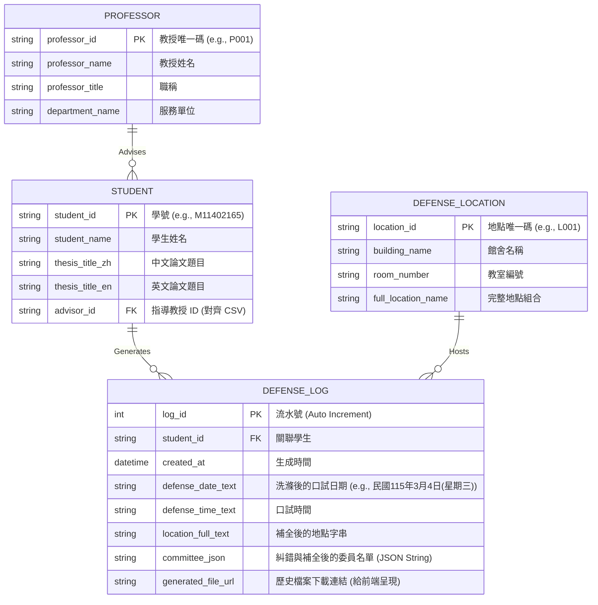

# 實體關聯模型與資料庫設計 (Database Schema)

## 1. 架構說明與技術選型權衡 
* **資料庫選型**: 使用 SQLite (`defense.db`)。
* **冪等性與字串主鍵**: 為配合外部 CSV (如 `P001`, `M11402165`) 的「資料驅動播種」機制，所有實體的 ID (PK/FK) 均調整為 `String` 型態。
* **陣列處理與防呆**: 因 SQLite 缺乏 `JSONB`，委員名單 (`committee_json`) 宣告為 `String`。寫入此欄位的資料必定經過後端的 **Fuzzy Search (模糊比對)** 與 **指導教授強制補全**，確保資料庫內的 JSON 結構 100% 正確無誤。
* **歷史追蹤**: `DEFENSE_LOG` 扮演「歷史紀錄儀表板」的核心，儲存洗滌後的最終狀態與 PPT `generated_file_url`，供前端調閱。

## 2. 實體關聯圖 (ER Diagram)

