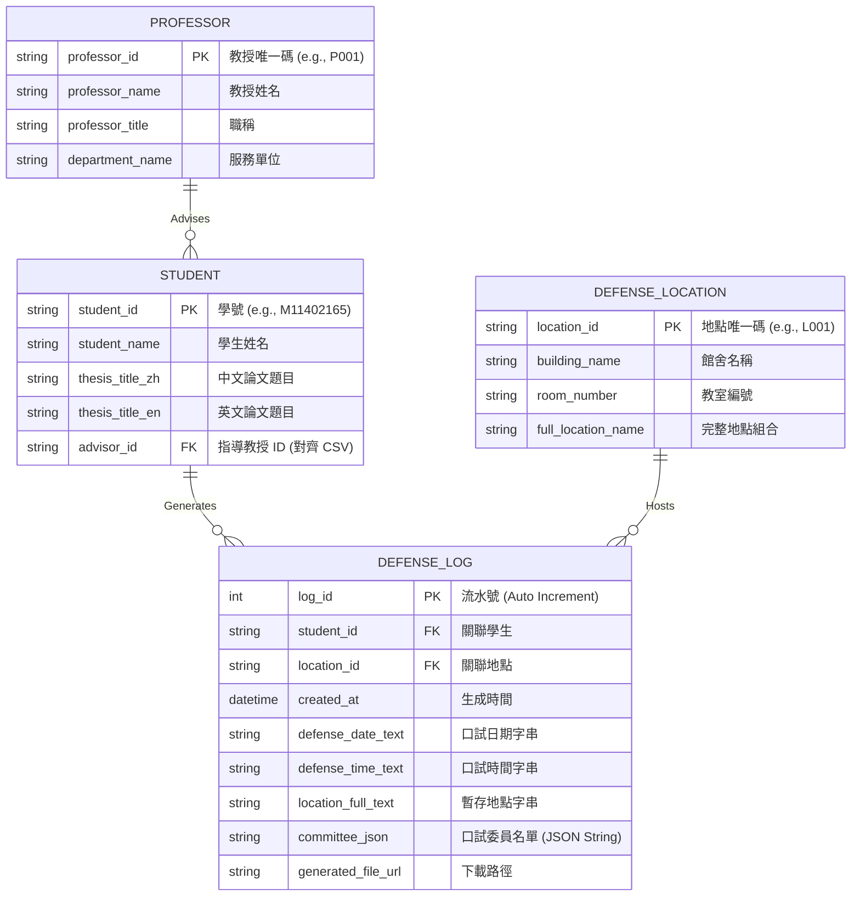

# 實體關聯模型與資料庫設計 (Database Schema)

## 1. 架構說明與技術選型權衡
* **資料庫選型**: 使用 SQLite (`defense.db`)。
* **冪等性與字串主鍵**: 為配合外部 CSV (如 `P001`, `M11402165`) 的「資料驅動播種」機制，所有實體的 ID (PK/FK) 均調整為 `String` 型態。
* **陣列處理**: 因 SQLite 缺乏 `JSONB`，委員名單 (`committee_json`) 宣告為 `String`，由後端 Pydantic Schemas 負責序列化防呆驗證。

## 2. 實體關聯圖 (ER Diagram)

