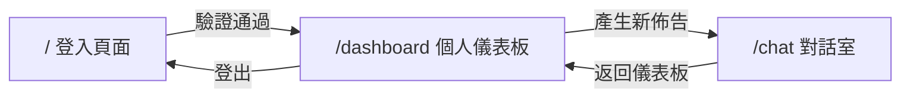

# 使用者介面與體驗規劃 (UI/UX Design)

本系統前端採用 **React + Vite + Tailwind CSS** 技術棧，以 SPA (Single Page Application) 架構打造三頁式體驗流程。透過 `localStorage` 管理登入狀態，以 `x-student-id` Header 與後端進行身分驗證。

---

## 頁面架構總覽

---

## 頁面一：登入頁面 (Login)
* **路由**: `/`
* **功能**: 使用者輸入「學號」後登入系統。
* **技術細節**:
  - 學號存入 `localStorage`（`studentId`），作為後續所有 API 呼叫的身分憑證。
  - 學生姓名於登入後由 Dashboard 頁面透過 `GET /api/v1/students/me` API 取得，另存為 `student_name` 供 ChatRoom 使用。
  - 登入後自動導向 `/dashboard`。
* **UI 風格**: 置中卡片式表單，圓角陰影，簡潔現代。

## 頁面二：個人儀表板 (Dashboard)
* **路由**: `/dashboard`
* **功能**: 顯示學生個人資訊與歷史口試佈告產出紀錄。
* **API 串接**:
  - `GET /api/v1/students/me`：取得姓名、論文題目、指導教授，渲染左側個人資訊卡片。
  - `GET /api/v1/defense/history`：取得歷史紀錄清單，每筆包含口試日期、地點及 PPT 下載連結。
* **UI 佈局**: 左右雙欄 (md:grid-cols-3)
  - **左欄 (1/3)**：個人資訊卡片（姓名、論文題目、指導教授）。
  - **右欄 (2/3)**：「產生新佈告」大按鈕 + 歷史產出列表（每筆可一鍵下載 PPT）。
* **防呆機制**: 若未登入（`localStorage` 無 `studentId`），自動導回登入頁。

## 頁面三：對話室 (ChatRoom)
* **路由**: `/chat`
* **功能**: 與 Dify Agent 進行自然語言對話，完成口試佈告的資料收集與生成。
* **API 串接**:
  - `POST /api/v1/chat`：將使用者訊息與 `conversation_id` 傳至後端代理，後端自動從資料庫注入學生姓名、論文題目、學號與當前日期作為 Dify inputs，再轉發至 Dify Agent 並回傳結果。
  - `GET /api/v1/downloads/{filename}`：需身份驗證的檔案下載端點，前端需傳遞 `x-student-id` Header。
* **對話流程**:
  1. 進入頁面後自動顯示 AI 開場白，提示使用者提供口試時間、地點與委員名單。
  2. 使用者以自然語言輸入，Agent 自動拆解意圖並逐步呼叫後端 Tool API 進行驗證與補全。
  3. Agent 完成 PPT 生成後，透過 Tool 3 API 儲存至資料庫並回傳下載連結（`/api/v1/downloads/{filename}` 格式）。
  4. **前端自動偵測下載連結**：ChatRoom 組件識別回覆中包含的 `/api/v1/downloads/` 路徑或 `.pptx` 連結，自動將其渲染為藍色下載卡片按鈕。
  5. 點擊下載按鈕時，前端執行 `authenticatedDownload()` 函式，將 `x-student-id` Header 附加到請求中，後端驗證後回傳檔案。
* **技術細節**:
  - 透過 `conversation_id` 維持多輪對話記憶。
  - 支援 `VITE_API_BASE_URL` 環境變數自訂 API 位址。
  - 訊息區域自動捲動至最新訊息。
  - 發送期間禁用輸入框與按鈕，顯示「管家正在排版中」動畫提示。
  - **下載機制**：使用 `fetch() + blob` 方式下載，確保 `x-student-id` Header 被正確發送，並由 `authenticatedDownload()` 函式統一管理。
* **UI 風格**: 全螢幕聊天介面，氣泡式對話（使用者藍色靠右、AI 白色靠左），底部固定輸入欄。